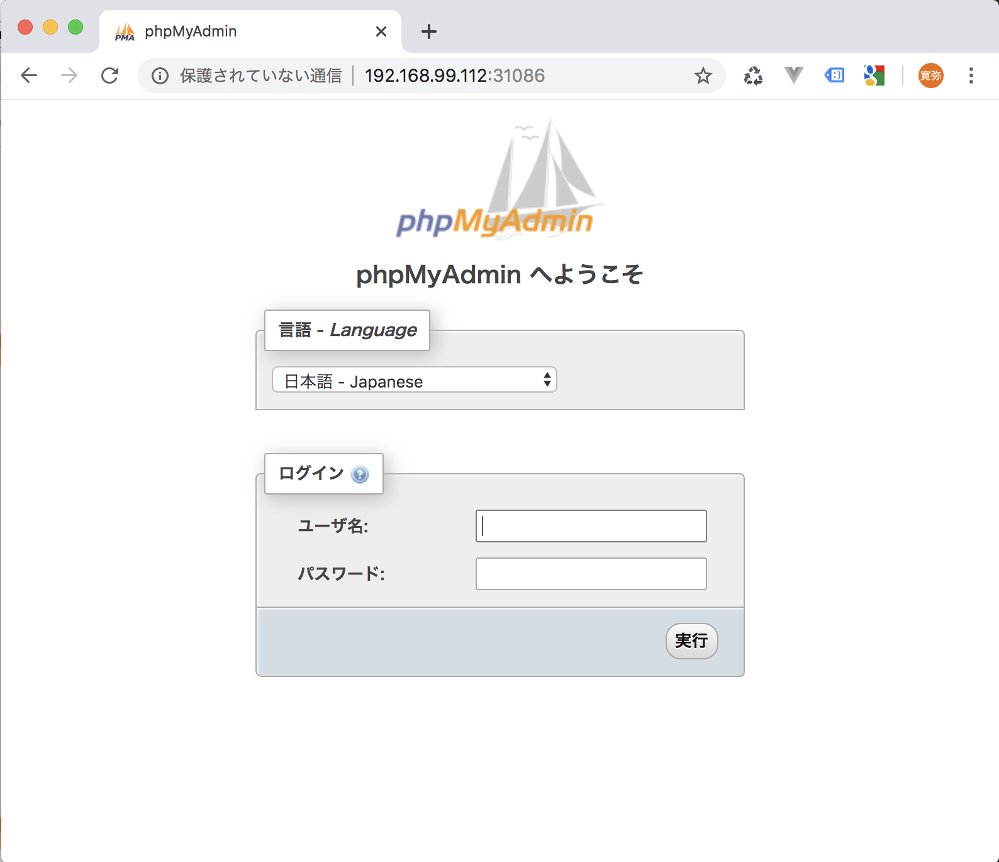

## Kubernetes ハンズオン 第6回 nginx を sidecar に使用した deployment の作成


### 1. namespace `app` を作成する

``` bash

~$ minikube start -p koujou05
There is a newer version of minikube available (v1.5.2).  Download it here:
https://github.com/kubernetes/minikube/releases/tag/v1.5.2

To disable this notification, run the following:
minikube config set WantUpdateNotification false
😄  minikube v1.1.0 on darwin (amd64)
🔥  Creating virtualbox VM (CPUs=2, Memory=2048MB, Disk=20000MB) ...
🐳  Configuring environment for Kubernetes v1.14.2 on Docker 18.09.6
🚜  Pulling images ...
🚀  Launching Kubernetes ... 
⌛  Verifying: apiserver proxy etcd scheduler controller dns
🏄  Done! kubectl is now configured to use "koujou05"

~$ kubectl get namespaces
NAME              STATUS   AGE
default           Active   2m43s
kube-node-lease   Active   2m46s
kube-public       Active   2m46s
kube-system       Active   2m46s

~$ kubectl create namespace app
namespace/app created

~$ kubectl get namespaces
NAME              STATUS   AGE
app               Active   3s
default           Active   4m15s
kube-node-lease   Active   4m18s
kube-public       Active   4m18s

```


### 2. namespace `app` を指定して configmap 作成

nginx_config.yml は第3回で作成したものに今回の修正(service部分)を加えたもの

```bash
# kubectl apply -f で nginx_deployment.yml を指定し実行

~$ kubectl -n app apply -f nginx_config.yml 
configmap/nginx-config created

```


### 3. namespace `app` を指定して deployment を作成

nginx_deployment.yml は第4回で作成したものに `name:pypmyadmin` の設定を追加したもの

```

~$ kubectl -n app apply -f nginx_deployment.yml
deployment.apps/nginx created

~$ $ kubectl -n app get pods
NAME                    READY   STATUS    RESTARTS   AGE
nginx-76d58f5f7-f9zjx   2/2     Running   0          2m56s

```


### 4. deployment `nginx` を公開する service を追加する

```
~$ kubectl -n app get deployment
NAME    READY   UP-TO-DATE   AVAILABLE   AGE
nginx   3/3     3            3           73s

~$ kubectl -n app expose deployment nginx --type=NodePort --name=nginx-service
service/nginx-service exposed

~$ kubectl -n app get services
NAME            TYPE       CLUSTER-IP     EXTERNAL-IP   PORT(S)          AGE
nginx-service   NodePort   10.99.21.222   <none>        8080:31086/TCP   9ss
```


### 5. port, ip 確認

```bash
~$ kubectl -n app describe service/nginx-service
Name:                     nginx-service
Namespace:                app
Labels:                   <none>
Annotations:              <none>
Selector:                 app=nginx
Type:                     NodePort
IP:                       10.99.21.222
Port:                     <unset>  8080/TCP
TargetPort:               8080/TCP
NodePort:                 <unset>  31086/TCP
Endpoints:                172.17.0.5:8080
Session Affinity:         None
External Traffic Policy:  Cluster
Events:                   <none>


~$ kubectl -n app get service nginx-service
NAME            TYPE       CLUSTER-IP      EXTERNAL-IP   PORT(S)          AGE
nginx-service   NodePort   10.108.116.87   <none>        8080:32602/TCP   2m30s

~$ minikube ip -p koujou05
192.168.99.112

```


### 6. ブラウザから確認


